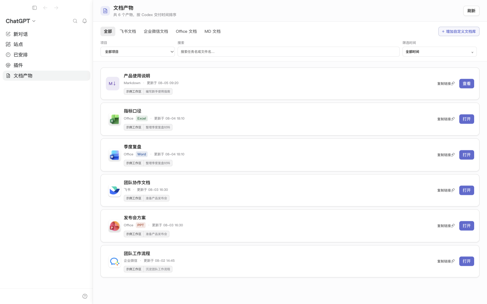

# Codex 文档产物

> [!IMPORTANT]
> **“文档产物”侧边栏入口目前仅支持 macOS 版 Codex。** Windows 和 Linux 可以使用完整的本地网页模式，但不会在 Codex 侧边栏中出现入口。

把 Codex 在任务最终回复中交付过的文档链接和文件，整理成一个可搜索、可筛选、可打开的本地文档库。在 macOS 上，它还能直接作为“文档产物”入口出现在 Codex 桌面版侧边栏中。

macOS 用户安装并启动后，不需要另找网页：点击 Codex 左侧的“文档产物”，就能在当前窗口里查找、打开或复制过去交付的文档。



当前版本：[`v0.1.1`](https://github.com/RuiChenKe/codex-document-artifacts/releases/tag/v0.1.1)（公开预览版）

## 它能帮你做什么

用 Codex 做了一段时间后，文档往往散落在不同任务里。这个模块会从**本机仍保留的 Codex 历史最终交付**中找出受支持的链接和文件，并统一展示：

- 默认扫描本机仍保留的全部历史，页面初始筛选为“全部时间”。
- 按项目、关键词、文档类型和时间查找。
- 识别受支持的飞书/Lark、企业微信文档链接，以及 Word、Excel、PowerPoint 和 Markdown 文件。
- 显示文档来自哪个 Codex 项目和任务，并可返回相关任务。
- 折叠展示同一文档的多次交付或可用版本。
- 点击“复制链接🔗”，把在线地址或本地文件路径复制到剪贴板。
- 创建自己的文档库，用域名或标题、正文、时间、文件大小等规则自动归类。

它不是全盘文件搜索工具：没有在 Codex 最终回复中交付过的文件，不会被自动收录。

## 隐私先说清楚

默认设置适合个人电脑使用：

- 服务只监听 `127.0.0.1`，也就是只有这台电脑能访问。
- 默认不会上传、同步或分享你的文档，也没有遥测或使用情况上报。
- 长期记忆读取和 Office 文件快照默认关闭。
- 索引、文档路径、链接和自定义分类都保存在本机。
- 在线链接只有在你主动点击“打开”时，才会由浏览器访问原网站。

启用任何可选能力前，请先阅读 [PRIVACY.md](PRIVACY.md)。安全问题请看 [SECURITY.md](SECURITY.md)。

本项目是独立开源项目，不是 OpenAI、飞书、腾讯或 Microsoft 的官方产品。界面中用于识别文档类型的第三方产品名称与 Logo 归各自权利人所有，仅作兼容性识别；详见 [THIRD_PARTY_NOTICES.md](THIRD_PARTY_NOTICES.md)。

## 小白安装：三步完成

下面是最省事的 macOS 安装方式。侧边栏模式需要已经安装 Codex 桌面版；Windows 和 Linux 用户请看后面的“从源码安装”。安装过程只发生在本机。

### 第 1 步：准备 Node.js

需要 Node.js `22.5` 或更高版本。不确定有没有安装也没关系：稍后的安装向导会帮你检查。

如果向导提示“没有找到 Node.js”，请打开 [Node.js 官方下载页](https://nodejs.org/zh-cn/download)，安装 **LTS（长期支持）版本**，完成后再继续。

### 第 2 步：下载并安装

1. 打开 [Releases 下载页](https://github.com/RuiChenKe/codex-document-artifacts/releases/latest)。
2. 在该版本的 **Assets** 区域下载 [`codex-document-artifacts-v0.1.1-macos.zip`](https://github.com/RuiChenKe/codex-document-artifacts/releases/download/v0.1.1/codex-document-artifacts-v0.1.1-macos.zip)。编程小白不要下载 GitHub 自动生成的 “Source code” 压缩包。
3. 双击 ZIP 解压，再双击文件夹里的 `install.command`。
4. 等窗口显示“安装完成”。第一次安装需要联网下载开源依赖，可能要几分钟。

如果 macOS 拦截文件，按住 Control 键点击 `install.command`，选择“打开”；仍被拦截时，可到“系统设置 → 隐私与安全性”确认打开。只应下载本仓库正式 Release 提供的文件。

### 第 3 步：启动

先在 Codex 菜单中选择“退出 Codex”，或按 `Command-Q`，确保它已经完全退出。然后双击 `start.command`，并保持弹出的终端窗口开启：

- 启动程序会重新打开 Codex，并自动进入侧边栏中的“文档产物”。
- 如果只想使用普通网页，可以在项目文件夹中运行 `npm start`，再用浏览器访问 `http://127.0.0.1:47824/`。
- 要停止服务，回到终端窗口按 `Control-C`，或直接关闭该窗口。

以后使用时只需重复第 3 步，不必每天重新安装。

## 1 分钟验证是否安装成功

1. 打开 [本机健康检查页](http://127.0.0.1:47824/health)。看到 `"ok":true`，说明本地服务正常。
2. 回到“文档产物”页面，确认时间筛选默认显示“全部时间”。首次扫描历史记录可能需要一点时间。
3. 找到任意一条文档，点击“复制链接🔗”，再粘贴到备忘录。能粘贴出链接或文件路径，就说明复制功能正常。

如果文档库暂时是空的，不代表安装失败。请先确认本机 Codex 中仍保留至少一个包含文档链接或受支持文件的最终回复，然后点击页面刷新。

## 从源码安装

这条路线适合会打开终端，或使用 Windows、Linux 的用户。请先安装 Git 和 Node.js `22.5+`，然后逐行复制下面的命令：

```bash
git clone https://github.com/RuiChenKe/codex-document-artifacts.git
cd codex-document-artifacts
npm ci
npm run build
npm start
```

`npm start` 会启动跨平台网页服务。请手动访问 `http://127.0.0.1:47824/`，并让终端在使用期间保持运行。

macOS 用户如果还要使用 Codex 桌面版侧边栏嵌入，可以把最后一条命令换成：

```bash
npm run codex
```

这个命令会启动同一个本地服务，并尝试打开或接入支持的 macOS Codex 桌面版环境。

开发者修改代码后，可运行：

```bash
npm run check
npm run dev
```

## macOS 嵌入模式与跨平台网页模式

| 使用方式 | macOS | Windows | Linux |
| --- | --- | --- | --- |
| 浏览器打开本地网页 | 支持 | 支持 | 支持 |
| Codex 桌面版侧边栏嵌入 | 支持 | 暂不支持 | 暂不支持 |
| 双击 `install.command` / `start.command` | 支持 | 不支持 | 不支持 |

Windows 和 Linux 用户仍可完整使用网页模式；只是需要通过终端安装和启动。

## 可选功能（高级设置）

普通用户可以跳过这一节，默认设置已经能完成文档检索、打开和复制链接。

项目根目录中的 `.env.example` 列出了可选设置。当前版本不会自动读取 `.env` 文件；需要启用时，请在项目文件夹的终端中把设置写在启动命令前。例如，只启用长期文档：

```bash
DOCUMENT_ARTIFACTS_INCLUDE_LONG_TERM=1 npm start
```

macOS 嵌入模式则把末尾的 `npm start` 换成 `npm run codex`。一次可以填写多个设置；没有写出的设置仍保持关闭。

| 设置 | 默认值 | 作用与风险 |
| --- | --- | --- |
| `DOCUMENT_ARTIFACTS_INCLUDE_LONG_TERM` | `0` | 增加长期文档视图，会扩大本机读取范围 |
| `DOCUMENT_ARTIFACTS_ENABLE_SNAPSHOTS` | `0` | 在本机保存 Office 文件副本，会增加敏感数据和磁盘占用 |

`DOCUMENT_ARTIFACTS_PORT` 的默认值是 `47824`。如果改了端口，请把本说明中的健康检查和网页地址也换成相同端口。服务地址固定为 `127.0.0.1`，不能通过设置改成局域网或公网地址。设置只对这一次启动有效，修改时请先停止服务，再用新的命令启动。

## 支持范围

### 会被收录

- Codex 最终回复中受支持的飞书/Lark、企业微信在线文档链接。
- Codex 最终回复中明确交付的 Word、Excel、PowerPoint 文件路径。
- Codex 最终回复中明确交付的 `.md` 或 `.markdown` 文件路径。
- 本机仍保留的全部历史任务。

### 不会被自动收录

- 只出现在中间过程、工具输出或草稿里，没有进入最终回复的内容。
- 没有被 Codex 交付过的普通电脑文件。
- 已从本机 Codex 历史中删除或不再保留的任务。
- 不受支持的文件类型。

在线文档是否能打开，仍由原平台的账号和权限决定；本模块不会绕过访问权限。

## “版本”和“交付次数”是什么意思

文档卡片下方可能显示“2 个版本”或“2 次交付”，两者并不相同：

- **多次交付**：Codex 在不同时间或任务中多次给过同一个地址。这里只记录每次交付的时间和上下文；在线文档打开后通常显示原平台的当前内容，旧内容要到原平台的版本历史里查看。
- **可用版本**：只有程序确实保存了一个可打开的本地快照时，才会把它当作历史版本。Office 快照默认关闭，因此默认不会额外复制 Office 文件。
- **Markdown**：默认读取当前文件用于本地展示；若原文件后来被覆盖或删除，本模块不能恢复旧内容。

换句话说，它首先是“交付索引”，不是自动备份系统。重要文档仍应使用原平台的版本历史或你自己的备份方案。

## 应用版本号是什么意思

项目使用 `主版本.次版本.修订号` 的形式，例如 `0.1.0`：

- 修订号增加：通常是兼容的错误修复。
- 次版本增加：增加功能；在 `0.x` 公开预览阶段，也可能包含需要留意的调整。
- 主版本增加：进入稳定阶段后，用来标识不兼容的大改动。

升级前建议阅读对应 Release Notes。重要工作环境可以固定使用某个已验证版本。

## 停止、更新和卸载

### 停止

在启动服务的终端窗口按 `Control-C`，或关闭该窗口。页面随后无法访问是正常现象。

### 更新

1. 先停止正在运行的旧版本。
2. 从 [Releases](https://github.com/RuiChenKe/codex-document-artifacts/releases) 下载新版本到一个新文件夹。
3. 双击新文件夹中的 `install.command`，完成后再双击 `start.command`。

本地索引默认放在 Codex 数据目录下，不会因为换了程序文件夹而自动删除。升级说明若要求额外操作，请以该版本 Release Notes 为准。

### 卸载

1. 停止服务。
2. 把下载并解压出的程序文件夹移到废纸篓。
3. 如果还要清除索引、缓存、自定义分类以及可选功能产生的数据，在 Finder 中按 `Shift-Command-G`，输入 `~/.codex/document-artifacts`，再把该文件夹移到废纸篓。

第 3 步不可撤销，但不会删除原始 Codex 历史或原文档。只想暂时停用时，不需要做第 3 步。

## 常见问题

### 页面提示无法连接

确认启动时出现的终端窗口仍然开着。也可以重新双击 `start.command`。若提示端口 `47824` 已被占用，通常表示已有一个实例在运行；先找到旧窗口并停止它，再重新启动。

### 提示“Codex 已经在运行”

这通常表示启动前只是关闭了 Codex 窗口，但应用并未完全退出。请按 `Command-Q` 完全退出 Codex，再双击 `start.command`。启动文件需要自己重新打开 Codex，才能把“文档产物”安全地加入侧边栏。

### 为什么有些旧文档没有出现？

程序会扫描本机仍保留的全部 Codex 历史，并且初始显示“全部时间”。若某份旧文档未出现，常见原因是对应任务已经不在本机索引中、Codex 的最终回复没有包含受支持的链接或路径，或者页面仍设置了其他筛选条件。点击“清除筛选”后再试。

### 为什么有些旧版本不能打开？

历史交付记录不等于文件备份。在线文档的旧内容应到原平台版本历史查看；本地文件若已被覆盖或删除，而当时又没有快照，就无法从索引恢复。

### “复制链接🔗”复制了什么？

在线文档会复制网址，本地文档会复制文件路径。本地路径只在拥有该文件的电脑上有效，而且可能透露用户名或文件夹结构；分享前请先检查粘贴出来的内容。

### 可以让同一局域网里的其他人访问吗？

不建议，也不是当前设计目标。服务默认只允许本机访问，并且没有面向公网或局域网部署所需的登录系统。不要把监听地址改成 `0.0.0.0`，也不要通过端口转发、反向代理或隧道公开它。

### Windows 或 Linux 能用吗？

可以使用网页模式，请按“从源码安装”操作，并用 `npm start` 启动。Codex 侧边栏嵌入和双击 `.command` 安装目前只支持 macOS。

### 安装窗口说 Node.js 版本太旧

安装 Node.js 最新 LTS 版本，然后关闭旧终端窗口，重新双击 `install.command`。最低要求是 Node.js `22.5`。

### 可以关闭电脑后一直运行吗？

不可以。它是本机服务，电脑关机、休眠或启动窗口关闭后会停止；再次双击 `start.command` 即可。

## 反馈与贡献

- 普通问题和功能建议：使用 [GitHub Issues](https://github.com/RuiChenKe/codex-document-artifacts/issues)。提交前请删除截图、日志中的文档标题、链接、本地路径和任务内容。
- 安全漏洞：不要公开发 Issue，请按 [SECURITY.md](SECURITY.md) 私下报告。
- 提交代码前请运行 `npm run check`，并说明修改目的和验证结果。

## 许可证

本项目使用 [MIT License](LICENSE)。
